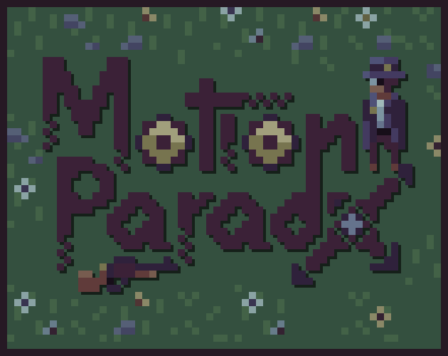
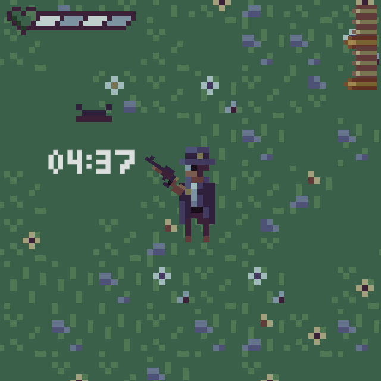
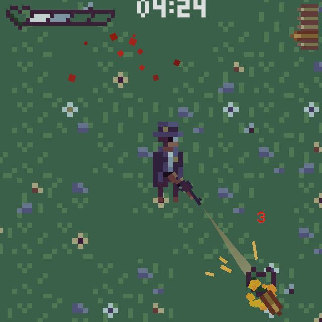
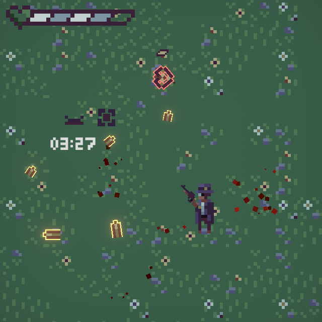
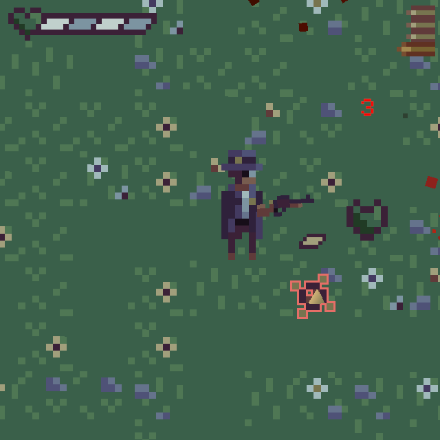
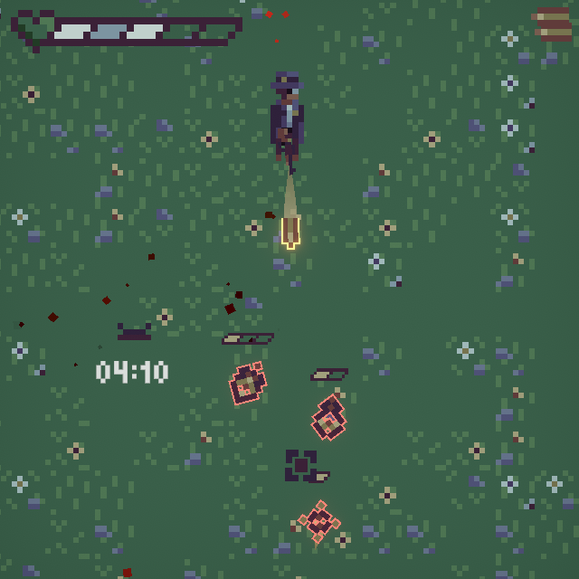

# MOTION PARADOX

  

## OVERVIEW

A steampunk-esque top-down action shooter game within an unstable dimension.

This game was originally an entry for [__LOWREZJAM 2024__](https://itch.io/jam/lowrezjam-2024), which started on _August 1st, 2024_. It was made within ___the last 72 hours___ of the jam.

However, the game was __further expanded__ with new features and polishing after the jam, so the __post-jam__ version is now available on [__itch.io__](https://constance012.itch.io/motion-paradox)

This `develop` branch is __PROTECTED__, it reflects the currently stable state of the game.

## DESCRIPTION

__Dr. Emit__, an ambitious time traveler, accidentally enters an unstable dimension when he was working on his new invention with his assistant at the lab. He then discovers that __time flows only__ when __he's standing still__.

Armed with his trusty steampunk-style __rifle__, he must repel those strange __flying gears__ and survive until the __time portal activates__, allowing him to restore the stability of time and return home. But he must be careful __not to shoot himself in the foot__ as his own bullets are not so friendly due to the unstable flow of time.

## TOOLS:

- Unity
- Visual Studio Code
- Aseprite
- Photoshop
- LabChirp

## LINKS

Check out the jam submission [__HERE__](https://itch.io/jam/lowrezjam-2024/rate/2898745). 

Play both versions directly or download for your current platform [__HERE__](https://constance012.itch.io/motion-paradox).

## INGAME CAPTURES

_© 2022-2025 CST Games, all rights reserved._