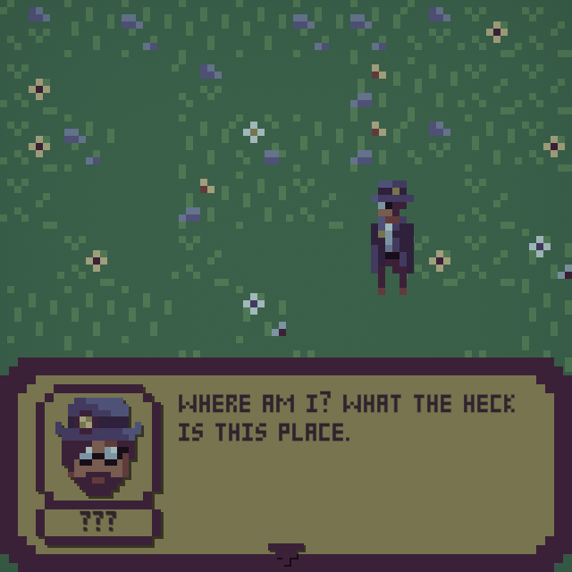
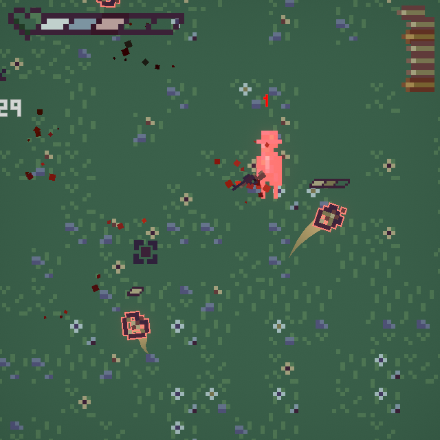
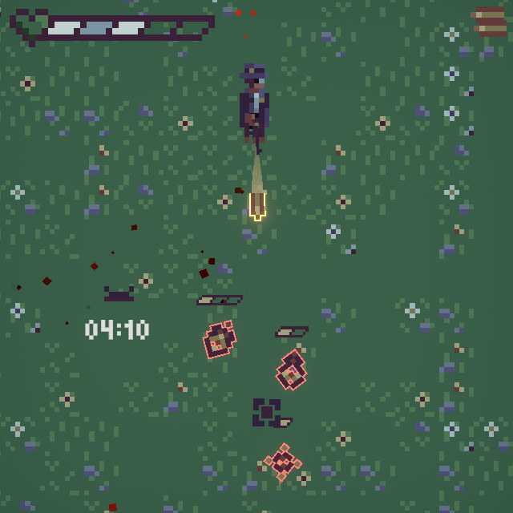

# MOTION PARADOX (Post-jam Version)

  

## OVERVIEW
A steampunk-esque top-down action shooter game within an unstable dimension.

This game was originally an entry for [__LOWREZJAM 2024__](https://itch.io/jam/lowrezjam-2024), which started on _August 1st, 2024_. It was made within ___the last 72 hours___ of the jam.

But since the submission deadline has passed, this is the __post-jam__ version of the game, where I am developing new features and expanding it further for future releases.

Switch to the `jam-original` branch if you want to check out the original version submitted into the jam.

## DESCRIPTION
__Dr. Emit__, an ambitious time traveler, accidentally enters an unstable dimension when he was working on his new invention with his assistant at the lab. He then discovers that __time flows only__ when __he's standing still__.

Armed with his trusty steampunk-style __rifle__, he must repel those strange __flying gears__ and survive until the __time portal activates__, allowing him to restore the stability of time and return home. But he must be careful __not to shoot himself in the foot__ as his own bullets are not so friendly due to the unstable flow of time.

## TOOLS:
- Unity
- Visual Studio Code
- Aseprite
- Photoshop
- LabChirp

## LINKS
Check out the jam submission [__here__](https://itch.io/jam/lowrezjam-2024/rate/2898745). Or play both versions directly [__here__](https://constance012.itch.io/motion-paradox).

## INGAME CAPTURES

