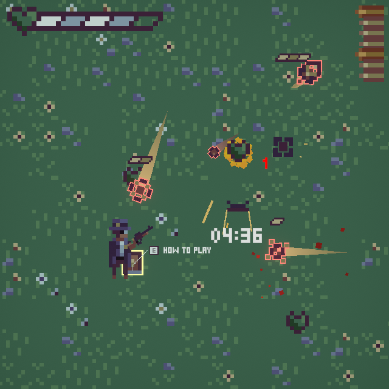

# Motion_Paradox

## OVERVIEW
A steampunk-esque top-down action shooter game within an unstable dimension.

This is an entry for __LOWREZJAM 2024__ on _August 1st, 2024_.

__NOTE__: This branch is __READ-ONLY__, which means there's no more updates or commits will be made in order to preserve the original version used in the jam.

Switch to the `post-jam` branch to stay up to date with the development process of this game.

## DESCRIPTION
__Dr. Emit__, an ambitious time traveler, accidentally enters an unstable dimension, only to discover that __time flows only__ when __he's standing still__. Armed with his trusty steampunk-style __rifle__, he must repel those strange __flying gears__ and survive until the __time portal activates__, allowing him to restore the stability of time and return home. But he must be careful __not to shoot himself in the foot__ as his own bullets are not so friendly due to the unstable flow of time.

## DEVELOPER'S NOTE
Unfortunately, this game is uncompleted and rushed, I began developing it a bit too late, because I was busy with work and stuff recently. That resulted in an extreme lack of time for the development process, and I had many features planned that I couldn't implement into this project. But overall, I had a lot of fun developing it regardless, and I learnt new stuff while also getting the chance to practice my pixel art skills. So it wasn't too bad.

## TOOLS:
- Unity
- Visual Studio Code
- Aseprite
- Photoshop
- LabChirp

## LINKS
Check out the submission [__here__](https://itch.io/jam/lowrezjam-2024/rate/2898745). Or play it directly [__here__](https://constance012.itch.io/motion-paradox)

## INGAME CAPTURES

